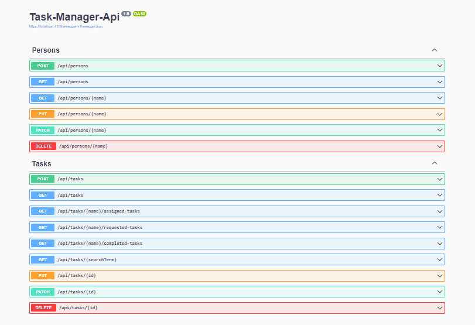

# Task-Manager-Api

A simple Asp .Net Core web api for task/todo mannagement

Tools and stack:
- ASP .NET CORE(.net 6.0)
- C#
- PostgreSQL
- Swagger UI
- Visual Studio 2022

Build and Run:
Clone or Download this repository. Change Connection strings for database connection in the Task-Manager-Api/appsettings.json. Then Run the solution file and it will redirect to Swagger UI interface and you are ready to request in the api endpoints.

## API ENDPOINTS:

**Tasks** (This controller manages all tasks associated with various persons):

- GET https://localhost:{port}/api/tasks => It retrieves all the available task items in the database. (check launchSettings.json in the Properties folder for port)
- POST https://localhost:{port}/api/tasks => It generates new task.
- GET https://localhost:{port}/api/tasks/{name}/assigned-tasks?date={YYYY-MM-dd or MM/dd/YYYY} => It returns a person assigned tasks for a day.
- GET https://localhost:{port}/api/tasks/{name}/requested-tasks?date={YYYY-MM-dd or MM/dd/YYYY} => It returns a person requested tasks for a day.
- GET https://localhost:{port}/api/tasks/{name}/completed-tasks => It returns a person completed tasks.
- GET https://localhost:{port}/api/tasks/{searchTerm} => It returns tasks based on search-word.
- PUT https://localhost:{port}/api/tasks/{id} => It updates a single {id} of task items.
- PATCH https://localhost:{port}/api/tasks/{id} => It edits single {id}'s some field of task items.
- DELETE https://localhost:{port}/api/tasks/{id} => It deletes single {id} from the task items.

**Persons** (This controller handles all available persons in the system):

- GET https://localhost:{port}/api/persons => It returns all the available person in the database.
- POST https://localhost:{port}/api/persons => It creates new person.
- GET https://localhost:{port}/api/persons/{name} => It returns a specific person's details.
- PUT https://localhost:{port}/api/persons/{name} => It updates the information of a particular person on the persons list.
- PATCH https://localhost:{port}/api/persons/{name} =>  It edits some particular fields for a particular person in the person list.
- DELETE https://localhost:{port}/api/persons/{name} =>  It removes a single person from the person list.

## Screenshot

 

</p
